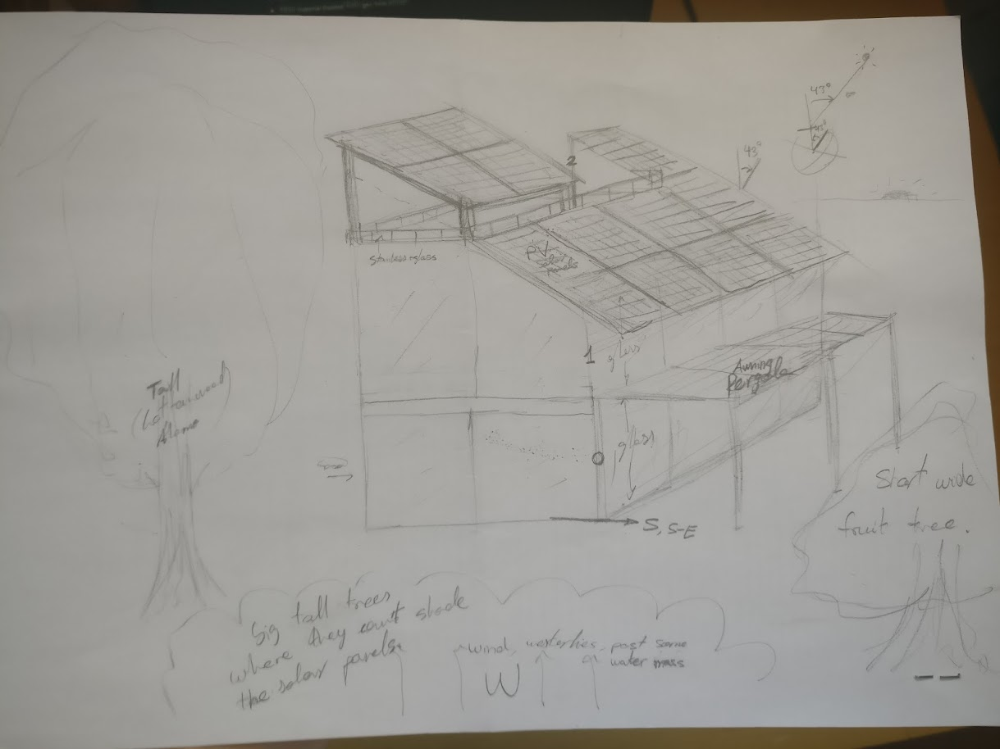

[Projects](../README.md) > [Home](./README.md)

# Contents <!-- omit in toc -->
- [New](#new)
- [Introduction](#introduction)
- [Main restrictions](#main-restrictions)
- [Layout](#layout)
    - [Layout overview](#layout-overview)
    - [Trees around the property](#trees-around-the-property)
    - [Workshop + Garage](#workshop--garage)
    - [Entrance (PMV parking, bins, shoes and coats...)](#entrance-pmv-parking-bins-shoes-and-coats)
    - [Main loft?](#main-loft)
    - [Kitchen](#kitchen)
        - [Island table](#island-table)
        - [Hanging shelving](#hanging-shelving)
        - [Countertop](#countertop)
        - [Big shelving](#big-shelving)
    - [Bathroom](#bathroom)
    - [Other](#other)
    - [Rooftop](#rooftop)
    - [Bedroom](#bedroom)
    - [Desk room](#desk-room)
    - [Play room (Living room)](#play-room-living-room)
    - [Bunker craziness](#bunker-craziness)
    - [Reading zone](#reading-zone)
    - [Instrument room](#instrument-room)
- [Where](#where)
- [Workshop](#workshop)
- [Water](#water)
    - [Heating](#heating)
- [HVAC - Temp of air](#hvac---temp-of-air)
- [Experiments, consider](#experiments-consider)
    - [Consider](#consider)
- [Notes](#notes)
    - [Acronyms](#acronyms)
    - [Doors](#doors)
    - [Curtains](#curtains)
- [Buy](#buy)
- [References](#references)

# New
- Try rendair.ai
- Pergolas bioclimaticas
- Mid Air woven playground? https://youtube.com/shorts/vfMidFUS3jE?si=zkaldV6lb_U6OpqP
- Wood stove? Nope, we had at home for years and didn't use it. Maybe in the attic, but not inside.
- All the cables and tubing exposed, like a garage tray. Easy maintenance and modification
- Corners seem annoying, but they're the ideal places for tables. Triangle or curvy shaped, go around you.
- Close the kitchen? separate room or some glass, to isolate smoke and noise. But eat there, so keep big.
- Underground pipe for thermal mass? T is constant about 1m below surface.
- Awning (heat) + Curtain (darkness) > Blinds (Noisy when closing at night and break). Window with no coating, let the heat in for winter.
- Add requirements for DANA, ridiculous amounts of water with high speed, depending on placement.

# Introduction

    
Home drawings

Find the most ideal places, and design a good independent house, from first principles.

**One of the most expensive things** that people buy in their whole life is their homes, so I think it would be a good idea to know very well and early what we’re generally looking for, in order to make the best possible buying decision. Even if we end up renting one, it’s still expensive, and affects our mood and productivity.

I’m looking for a home design that **makes me productive** with the least possible effort, and does not hinder with useless stuff. **I want simplicity, but not limitations**. Design to not have problems. Minimum maintenance.

**Minimalism. Reduce the amount of stuff.** Have only a few quality electronic products with USB-C charging ports. Even remove potentially useful things that I use so rarely that when I need them, I don’t know where they are or even remember that I have them. Consider how to remove keys.

I like to build and design things, so I will add a workshop.

I don't want to have to water the plants by design. I'll do it if I want, but the house has to be nice without me having to be physically there and remember that responsibility. The little watering must be automatic. Most plants should be in the ground, like in a forest, with natural mycelium networks connecting them together, not in pots.

The house must withstand the roots of the trees. How to do it? (Metallic, ceramic, rocks, or chemical barrier)

The ground with grass-like strong and low maintenance plants.

**Off-grid capable, with storage and many solar panels, lots of rainwater collection and filtering**

> About this document: The quotes like this one will be used to express the reasoning behind each decision, so it's easier to follow the description of the house.

# Main restrictions
> I'm assuming a nothern hemisphere and a bit coldish climate, southwards from the top of a hill. Otherwise the orientations have to be adapted.
- Sunlight: Distribute heat evenly around the house and around the day
    - Block most of the noon light, allow most of sunrise light, and some of sunset light. Awnings and curtains (Rolling shields or blackout curtains)
    > At sunrise (the coldest moment of the day), the light must be able to heat the house from the east, through the entrance. 
    > 
    > At noon it must be minimized
    > 
    > At sunset somewhat allowed for the best light of the day.
    > 
    > The awnings block the light, the inner curtains diffuse it.
    > 
    > The heat is better distributed with a few rooms long in north-sourth, so convection works, rather than long east-west, where the ones at south are cooked and at north frozen.
- Access: To the house, all floors, and the workshop and garage
- Solar panels: South roof is inclined optimally for solar panels. They shall not be blocked.
- Trees: I want as many trees around as possible, without breaking the other requirements.
    > privacy, noise, wind, air quality, aesthetics
    > Extends further down a lot, for extra summer shade even beyond the window (curtain wall), also outside, and leaves a place protected from rain. At the north, the roof is useless so -> rooftop
- Noise: I want to be able to make noise whenever I want (workshop and piano for example), but I don't want noise. Therefore, the house won't share walls with other neighbors.

- All water, electricity, fiber optic lines, etc. accessible like garage trays for cables.
- **Noise isolation** around the house, between rooms, between workshop and rooms.
    > Look for GreenGlue for holes, Acoustic Panels, Mass loaded vinyl between 2 layers of drywall, Acoustic Coat/Paint, Acoustic sealant, acoustic drywall… Also use bookcases, carpet, or noise absorbing panels on the ceiling for noise absorption
- **Off-grid capable, with storage and many solar panels, lots of rainwater collection and filtering**.
    - Separate drinking water, grey water, and dirty water. Store cold and hot water. Ability to bring water with a pickup. Also some hump at the lower part of the property to keep rainwater and make it filter into the ground. Filter drinking water more exhaustively.

- The bathroom at the warmest place: south or south-east (warm in morning).
- The kitchen at the west of the entrance, with the storage area (huge shelving) at north.

# Layout
## Layout overview
House stuck to the north side of the property, people enter at the east, cars at the north, with the huge workshop door being for both workshop and garage.
The ceiling is inclined at south, with solar panels, but not at the north side, where there's an attic.
There is huge glass from floor to ceiling. Fruit trees at the south, large trees at the north.

## Trees around the property
The elevation is lower at the south of the property. Put there small deciduous fruit trees that don’t block sunlight in winter but do in summer, and never block sunlight to solar panels because they're not very tall, while the fallen leaves won’t bother since the elevation is lower and they will stay there. The house is northwards, with a wall of huge evergreen trees at the north (and west), where they never shade the solar panels and don't block useful sunlight in winter.
- Birdhouses to attract bug-eating birds, like hummingbirds or swallows. https://youtu.be/1O8J9I-AKHU

## Workshop + Garage
- The north side of the house is placed right at the end of the property, with the garage door exposed to the road, allowing car access to the workshop and garage. Concrete or cement floor, no grass or trees.
    > There is no outside wall at the north. The house IS the wall. This lets us save space and prevents from having to go through 3 doors to get outside.
    >
    > About the noise from the road, notice how the workshop separates the house from the road. It should be minimal.
    > 
    > At the workshop you'll need protection. Clothing that will make you warm. There are components sensitive to too much heat. Therefore we leave the coldest place for the workshop.
- The garage door open both the workshop and garage. They are the same room, with movable separator to protect the cars.
    > This allows to adjust for different amount of cars parked, and direct access from outside.

## Entrance (PMV parking, bins, shoes and coats...)
- At the east side, entrance with stairs going to the attic at the top.
    > Allows to add just 1 door outside or 1 door per floor, for a business, renting a floor etc
- Places to leave wet jacket, keys, shoes, and leave dirty personal mobility vehicles charging ([EUC Rack](https://youtu.be/p5WFj-knABI)). It's fireproof.
- Contains the main trash bins
    > Might be cool to throw trash from any floor down there, with a tube or something
- Contains the mail box: About 60x60cm hole to throw packages into a protected box, where the packages can't be stolen from outside, and they land into a soft place to not be damaged, so postmen can deliver packages without anyone at home. TODO ADD COMMERCIAL ONES AS REFERENCE
    > Having the house be the wall itself allows for this: to access the mail from inside the house.
- Might be at a lower level than the rest of the house. Inside floor clean and comfortable and entrance floor dirty and resistant.
- Contains the dashboard that shows energy consumption per room and plug, home controls, the breakers
- Contains cleaning place with broom, vacuum cleaner stuff stored
- Contains emergency kit? Or better in the workshop.

## Main loft?
**Work place** with a **Huge table** (~90cm high, >=1x2 m) at a corner with adjustable height and bin holes, that turns around the user. It's not necessary to have height adjusting tables if you have height-adjusting chairs, unless you want a standdesk. Just have the table a bit high, and let the people adjust the relative height with the chair. I don't think that having my legs hanging is so bad.

**Pegboard** with tools separated in sections, and a **shelving wall**. *Modular? ~1.5m tall?Transparent pegboard?* Lots of **sockets** (~32 plugs) on the pegboard. Type N, and universal (C,F,G,A,B,L,J,…) sockets. Also USB-C with USB-4 standard protocol (Power Delivery), and USB-A. (A couple of HyperJuice Stackable GaN 100W chargers)

**Smart section** (likely in shelving wall) with google home max, nest hub, Alexa, smart thermostat (*Nest learning thermostat, NetAtmo…*), router, robot vacuum (Deebot Ozmo 950)

## Kitchen
**American kitchen** with a tall **island table**.

windows that don’t hinder when opened (high or sliding)

Raised dishwasher right by the island table, in the other side of the narrow passage formed with the counter.

Optional sliding glass doors with rail on the ceiling, continuous floor (no mess cleaning the rail and ok for vacuum robot)

Double Tank sink discarded, just have a large one, you can add accessories later. Ok for big stuff.

Diamond shape cabinet on the corner of the wall

### Island table
- with the sink
- water tap (to fill glasses of water directly on the spot and clean the dishware next to where it's used)
- trash bins (consider a trash can drawer, next to the table)
- tall stools
- Should be able to sit on all sides of the island table, with tall backless 3-legged stools. Consider the required overhang to not hit the table with the knees (~>= 38cm), and at least 60cm of space per person. Can use hidden island countertop brackets. 

### Hanging shelving
- Over the island table
- Dispenser
    - Salt, pepper, oil, vinegar
    - Paper dispensers (normal kitchen paper, plastic, aluminum)
- Storage over the sink for dishware and silverware, so it can dry and be stored in the same place, dripping over the sink.
- Also store pans and pots, rags
- sockets, free space, and the light bulbs right over the table.

### Countertop
At the corner of the countertop is the **induction hob**, and a cooking robot nearby (to cut, heat, weigh, measure temperature, program foods...), with stainless steel pans. From the corner it's much easier to absorb the fumes of the cooking, and the person cooking hinders less there (the fumes go through the wall outside without bothering solar panels). Also the cooking mess won’t dirty the eating table. Wall has to be of clean material there (tiles, stainless steel, or glass splashbacks).

The external countertop accessible from the outside when the window/wall is opened.

### Big shelving
With all the food storage (open shelving or just a cloth to keep clean of dust and grease) next to the fridge (same purpose as shelving, just cold) which is at the north (coldest place). It must be deep to store all the food there. Transparent plastic boxes as drawers. Consider a dedicated beverage fridge (not freestanding, with vents). Cabinets up to the ceiling for + space and - dust acumullation.

## Bathroom

I always like warmth in the bathroom. Even in summer. Therefore I will reserve the warmest otherwise undesirable place of the house for the bathroom. South with lots of glass and sunlight. South-east for morning heat

**I change my clothes in the bathroom everyday, when I shower, so the clothes must be stored and cleaned there**. Bathroom/dressing room/cleaning room.

The **dresser, washing machine**, wet cleaning products near the washing machine (To scrub you need water, and bleach is often used in the bathroom) all inside the bathroom.

Consider direct access to the outside to hang the clothes or go to the bathroom in a hurry. Should be secure.

The bathroom must have **ventilation** (HVAC in addition to a window) and the closet may have a ~curtain to keep it completely dry. Wet clothes will dry there. I have tested it and my clothes are perfect in the bathroom.

A **mirror wall**, glass wall, and **marble (carrara) or pallet floor** that does not slip, + white ceramic tiles, marble or wood for the rest.

Imagine the door, the side of the bathroom accessible first (opposite to the door hinge) is where the WC must be, so you can get there quickly and open the door while sitting. The sink next to the WC, have somewhere to put stuff while in the WC. Then the shower goes at the free corner that shares a side with the sink. That side is the "wet" side of the bathroom. Washing machine anywhere that doesn't bother.

- Shower
    - Electric shower with fixed water outlet from the ceiling and a water outlet with handle that can be placed in a hanger like a normal tap, with control for the water flow and temperature (*with thermometer?*). With soap dispensers (shampoo, gel, cream). The drain at one border of the floor.
    - One side of the shower is a mirror. Use the shower to wash teeth, shave, exfoliate, apply creams and stuff... In that way it's easy to clean everything. Lots of storage for products. Put the sink in the shower? All the floor ends up wet so it's not such a problem.
    - Towels stored right beside the shower.
- Dresser
    - Tall modular (Brickbox) shelving with hangers in its vertical structure. (Generally, try to use shelvings rather than drawers)
    - Shoes, crocs, socks... at the bottom. Pants, shorts and swimsuits above. T-shirts and sweatshirts at shoulder height. Scarfs, hats, and gloves higher.
    - Many hangers for jacket and others.
    - All clothes, clean and dirty, cleaning products, spare shampoo, gel, soap, bleach, detergent... Very big
    - **Toilet** with central jet to clean (normal or smart. joystick or electronic), without external bidet nor bathtub.

## Other
- Water storage, so it goes at the up-north of the property or house. Have a flood system to protect from fires. Since the house is at high elevation, floods won't bother it.
    > Needs high place, to have passive static pressure
    > Needs cold, to not spoil

## Rooftop
Rooftop to chill under the stars or nice sunset/sunrise. Some structure to provide shading, fire pit?, 
The floor/ceiling extends southwards for shading and eastwards to cover the entrance when it rains.
Hammock and stuff, place to read.

## Bedroom
Tiny, simple, relaxing and cozy bedroom, with tatami and futon. Elevated platform or small room with carpet tiles, windows, smart bulbs.
> This must NOT be part of the loft. There are lots of things that might make noises or lights during the night. Better separate tiny room

Oriented at east, without street lights, so that you can wake up with the sunrise (if you want).

## Desk room
The layout will be a big table that goes around you in the shape of U, one side of the U against the wall, the other free to the room, so you could sit with other people in conversation.

## Play room (Living room)
Games, TV, couch, place for reading (light, socket, carpet, shelving with books)

Probably floor -1, since it's dark and easily isolated from the rest of the house. Good for films, and close to the kitchen.

## Bunker craziness
would go in floor -2 if I were to add it.

## Reading zone
Either room or cozy zone to chill, read close to a window in a sofa

## Instrument room
Piano in room probably at south-west of floor 1.

Soundproof etc.
Might use this as guest room too.

# [Where](Where.md)

# [Workshop](Workshop.md)

# Water
Take the water from the rain, filter it, and store it clean. This allows us to add water with a truck in case of drought.

Drinking water, grey water, and dirty water will be separate.

Make some hump at the lower part of the property to keep rainwater and make it filter into the ground.

## Heating

The house will have no gas, so there must be a system to heat the water with electricity (or solar energy).

1. Investigate taps that can warm water instantly, without a boiler. This would provide hot water instantly, without wasting water.
2. Investigate an electric boiler with heat pump. This lets the use of electricity when it is cheapest and most abundant.

# HVAC - Temp of air
The system will use first all the natural resources available, opening and closing windows, curtains, etc. Then, it will use the heat pump to get the perfect temperature. [Here I coded how it will behave](./hvac_pseudocode.py).

The workshop needs good air circulation, so it will use electric radiant or infrared panel heaters.

Ventilation from window at west to the attic (chimney effect), kitchen and bathroom.

    
Discarded:

- Heated floor
    - A simple heat pump (split) should be more than enough

    
Heat exchanger

A heat exchanger (or recuperator) will continuously keep the air fresh, and eliminates the need to ventilate the house and then warm it up again. This saves energy while improving air quality.

Can be done with rotary heat exchangers, or ducted plate.

    
Actuated windows

To ventilate faster and automatically, for example in summer nights, to keep the house cool with 0 energy, at least 2 windows in opposite sides of the house will have an actuator to open and close automatically.

    
Insulation and thermal mass

**Big thermal mass inside. The house and hot water of the tank can be heated/cooled when power is cheapest or more abundant, and the heat stored for later.**

- The thermal mass will shift the warm part of the day towards the afternoon.
- If you ventilate the house when it's cold, thermal mass will bake it more expensive to warm up again. The house should remain sealed if undesired temps.
- Methods to increase thermal mass: slabs, water, water wall…
- In summer, you could ventilate at night and keep the house cool all day
- In winter, you could heat at noon, when the solar panels are at full power and the outside air is warmest (so the heat pump takes less energy)

# Experiments, consider
- Room at level 0, with the Kitchen? To be close to workshop?
- librería en planta 1?

    
Phase Change Material

Maybe use [Phase Change Material (PCM)](https://phasechange.com/). Some paraffin waxes could stabilize 23ºC with prefab homes. Be careful to use it in a house with a constant desired temperature. If the house is manually ventilated with undesired air temperatures, or the user wants high temperature changes, it can increase the energy consumption (obviously). *For example: In the summer cool the tank at night with the exterior radiator, and at daytime let the heat pump use the water tank instead of the exterior hot air to cool the house. In the winter, heat the water at 3pm with the exterior radiator, and let the heat pump extract that heat at night (more efficiency and less problems with freezing…)

    
Water filled passive radiator

Very simple and stabilizes the temperature. Transfer heat through air convection.

[Desiccant air conditioner](https://youtu.be/R_g4nT4a28U)
## Consider

- Use glass that blocks IR in some locations? Prevent IR from the warm house from coming out in winter, or sun IR in summer. Maybe west windows with it, or only the upper region of the window, like a virtual awning. Only heat in winter towards the floor.
    - Normal glass lets UVA through (gets to deep skin layers, can be harmful, cause of skin cancer), but blocks UVB (what creates tan, vitamin D, and skin burns). UVC is damaging but absorbed by the ozone layer. I want only UVB through.
- Some place that allows community without the hindrance of doors, fences, having to let someone in... No stealable stuff and open. Promote the town vibes. Not the depressing usual ones. Maybe just a cool tree-shaded bench near the entrance.
- Several underground floors that take advantage of all the thermal mass of the ground, specially if the temperature fluctuates a lot.
- Consider the elevation difference and access points (workshop at north, vehicle entry taking elevation into account)
- Overhang with a cut at ~3mm to prevent liquids from sticking to the overhang.

- paraffin wax phase-change material to stabilize nice temperature perfectly
- Consider geothermal source to connect the heat pumps, if the location has great temperature changes. It's more efficient and prevents freezing the exchanger.

# Notes
## Acronyms

| Acronym | Meaning |
| --- | --- |
| HVAC | Heating, Ventilation, and Air Conditioning |

- Plants:
    - **Big trees**: Oak, poplar (type of cottonwood), cottonwood (alamo o chopo), Ash, maple, Redwood or sequoia, pine, Buckeye, Willow.
        - **Beware with aggressive roots**: Fig tree, Eucalyptus, Elastic ficus, willow, poplar,
    - **Fruit trees**: Fig, Apple, Strawberry, Loquat, Quince, mulberry, Sweet Almond.
    - **More fruit plants**: Raspberry, Blueberry, Gooseberry, Currant, Blackberry (spikes), Honeyberry, Goji berry,
    - **Grass-like**: Dwarf Carpet of Stars
    - **Interior**: Kentia plant

    - Interior plants in water
        - Lengua de suegra
        - Cabeza de flecha
        - Suculenta Jade
        - Filodendro corazón
        - Pothos

    
Wall Material

- Mainly glass curtains, just glass. Otherwise clear walls.
    - Quartz glass (normal glass, silicon oxide), let all UV through, and infrared.
    - Laminate between glass blocks all UV.
    - Starphire, some acrylic also let all UV through.

- **Clear wood planks (plywood). Wood paneling**
- **Bricks**
- **White painted concrete (lime?)**
- **Cementitious: White portland cement + gypsum + white sand**
- Raw white fine concrete plastering (Repellado del enjarre en bruto)
- Tinted glass
- Pegboard surface
- Cement board (Duroc)
- Lath with Woodchip-Clay
- Fiberglass Reinforced Panels, Fiberglass mat
- Gypsum panels
- Exposed concrete block (noise through the structure?)
- Don't use gypsum finish (releases dust, it's not resistant, bad with humidity, hard to paint, hard to wash without destroying the paint, it flakes off).

    
Floor material

It must withstand water, friction, sunlight, heavy objects with thin feet, not sag.

- marble (for bathroom)
- thick stone (granite)
- concrete slab
- epoxy
- cement
- tiles

## Doors

**Few hinge or sliding doors with magnetic latches** on both ends to fix them open or closed.

- **Bathroom**: Sliding doors with public bathroom indicator.
- **Entrance**: [Smart lock](https://nuki.io/en/) that connects to the key/knob from inside, maybe with a double clutch to still be able to use keys.
- **Workshop doors**: Sliding or hinge in both directions, with magnetic locks only.
- With seal like swiss doors
- Should be able to lock open.

## Curtains

Rolling shields at the south. **Opaque insulating blinds (Stop partially sunlight + blockout) + thick translucent sheer curtains.** Some of them roller, so that I can block sunlight from my head, but not

Normal or roller, both smart. *Would be super cool to have smart film on the glass, to regulate the temperature for free, making the glass change from transparent to white translucent or change the reflectivity.*

- Luminette privacy sheers (smart, translucent + opaque)
- S Fold. Open/close automatically depending on the temperature and routines.
- Rose Home Fashion Blackout curtains

    
Countertop material

- White (light) granite
- A little porous. Very resistant to chemicals, heat, UV. Cheap.
- Sealing?
- Engineered Quartz composite
- Quartz dust with 7% resin.
- Discolours a bit with UV.
- [What's the best kitchen countertop?](https://youtu.be/ZiG-qyEvyM0)
- Quartz variations: Agate, quartzite
- Slate
- Concrete
- Porous
- Not marble because acids and heat damage it, and it's porous.

# [Buy](./buy.md)

# References
- Sunthalpy Origen
    - Heat exchanger, heat pump, solar panels, uses radiator with the outside to get energy to the heat pump. Floor heating. THE CLOSET IS IN THE BATHROOM!. Lots of these ideas.
- https://database.passivehouse.com/en/
- Temperature
    - [arizona_temperature_passive.pdf](arizona_temperature_passive.pdf)
    - [https://www.nrel.gov/docs/legosti/old/17135.pdf](https://www.nrel.gov/docs/legosti/old/17135.pdf)
- Nomad Capitalist
    - [The Best Countries in the World to Live in](https://youtu.be/cFqd991o1N8)
    - [My Master Plan to Live, Travel, and Buy Real Estate](https://www.youtube.com/watch?v=lXtF5qLBTAY)
    - [Alternative Countries](https://youtu.be/EMHE-hh5LeQ)
    - https://nomadcapitalist.com/articles/
    - https://www.prosperity.com/rankings
    - https://nomadcapitalist.com/nomad-quality-of-life-index/
    - Montenegro in the summer, London in the Fall, and Malaysia in between.
- Climate
    - [What is global circulation? - Met Office](https://www.youtube.com/watch?v=7fd03fBRsuU)
    - [Which city has the best climate in the world?](https://medium.com/@BambouClub/which-city-has-the-best-climate-in-the-world-355e013e9e95)
- Tiny house
    - [https://www.itinyhouses.com/tiny-homes/35-frugal-tiny-houses-can-build-buy-budget/](https://www.itinyhouses.com/tiny-homes/35-frugal-tiny-houses-can-build-buy-budget/)
- [ali-abdaal - my-productivity-desk-setup-2019](https://watchnebula.com/videos/ali-abdaal-yt-my-productivity-desk-setup-2019)
- Bunker
    - Small underground bunker with water, medicine, food, weapons, and essential tools.
    - [https://youtu.be/EL7xW5zTh6M](https://youtu.be/EL7xW5zTh6M)
- Vitruvius: The Ten Books on Architecture
- [Kitchen Remodel Ideas YOU DIDN'T THINK OF YOURSELF!](https://youtu.be/AHgcr1wGrwI)
t-my-productivity-desk-setup-2019)
