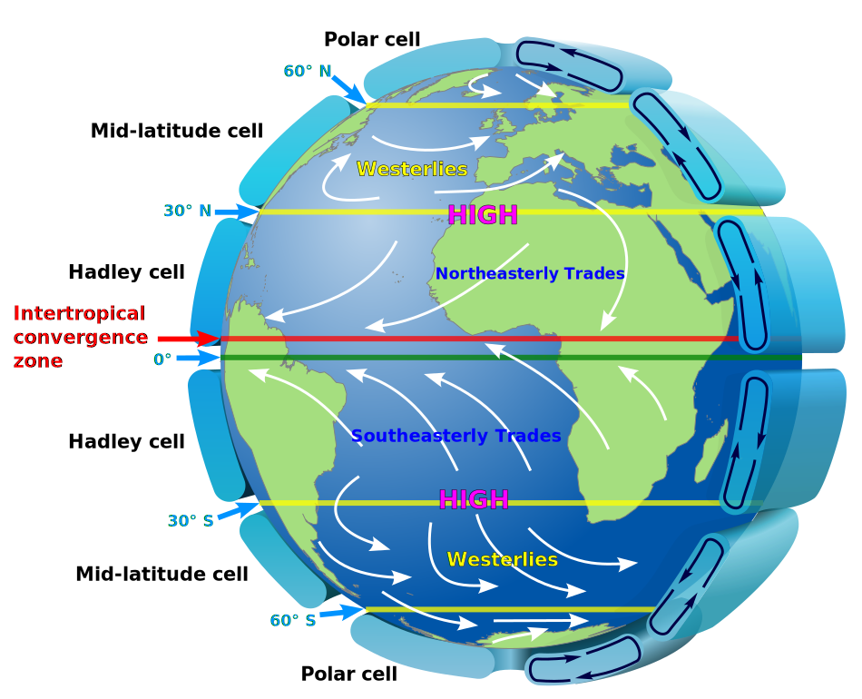
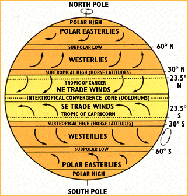
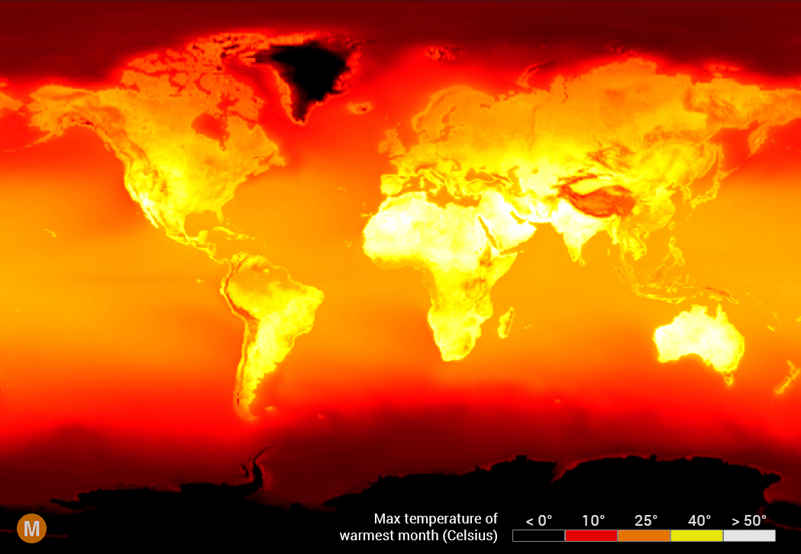
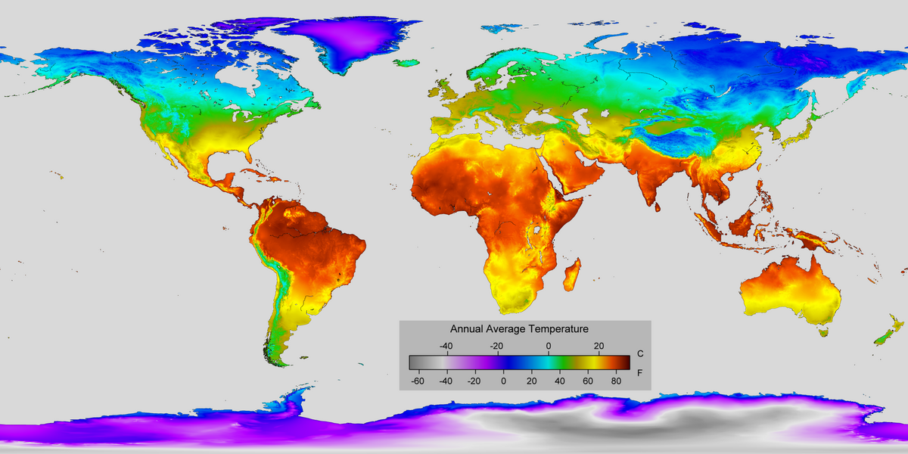
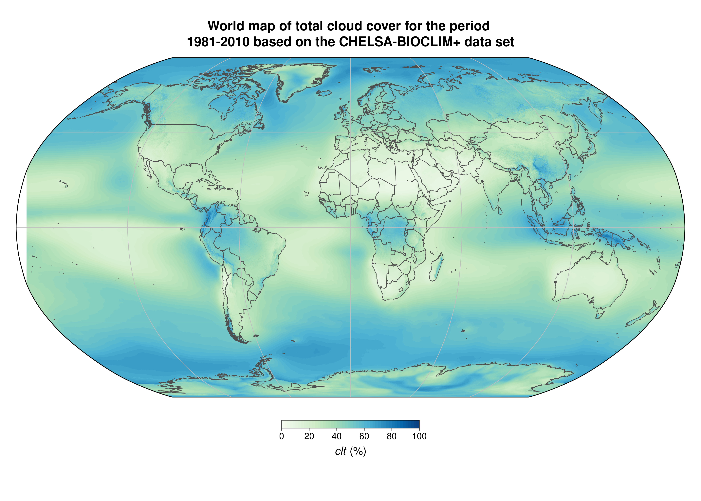
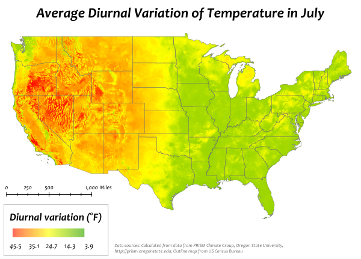
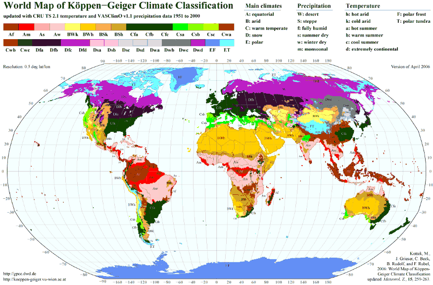
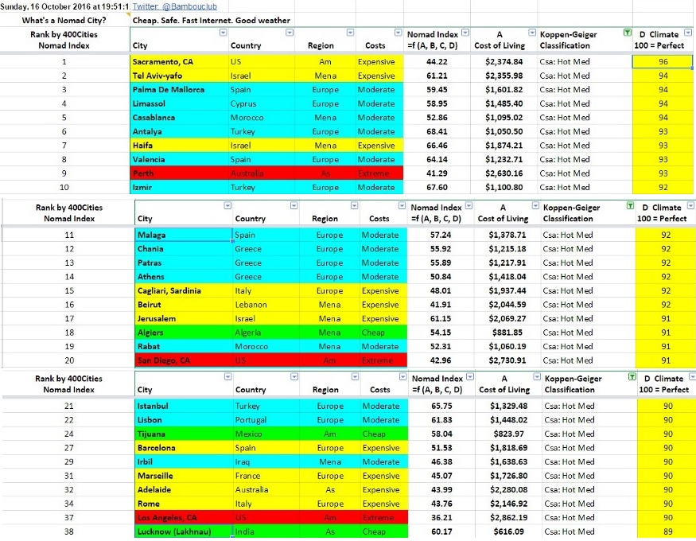

[Home](Home.md)

# Contents
- [Contents](#contents)
- [Introduction](#introduction)
- [Requirements - Filters](#requirements---filters)
- [References](#references)
- [Datasets](#datasets)

# Introduction
I feel okay in 10-30 ºC, optimum 22ºC, 12-36ºC with fast wind. However let a bit colder to account for winter nights.

Use some "equivalent temp", taking humidity, wind, and sunlight into account. (Humidity exaggerates the temperature, a little wind goes a long way, sunlight can fry you)


<details>
    <summary>Country list</summary>

- Switzerland
- Texas
- Andorra
- Holand
- Lisbon, Porto
- Georgia (no US)
- Florida
- Australia
- Puerto Rico - USA without USA taxes
- Estonia
- Nevada
- Panama
- Ireland
- Isla Margarita
- Tennessee
- New Hampshir
- Singapore (Cool but $$), Malaysia?
</details>

# Requirements - Filters
- Temperature
    - `t_max =` average of all max temps for each day within the warmest month. Must be < 30 celsius
    - `t_min =` average of all min temps for each day within the coldest month. Must be > 3 celsius. Definitely above 0.
    - ```python
      def points_for_temp(temp: float, t_min: float = 3, t_max: float = 30) -> float:
          # The further you get from the extremes, the more points you'll lose. The optimum temp is the average of t_max and t_min
          return - (t_min-temp)**2 - (t_max-temp)**2
      
      place.points += points_for_temp(place.t_max)
      place.points += points_for_temp(place.t_min)
      ```
- Rainfall
    - `rain_speed_max =` 90th percentile `q(0.9)` of max rain_speed (This filters crazy not normal storms, but cares about the maximum) between 6:00 and 21:00
    - Filter out the places with top half rain_speed_max
    - (Plot this in map and histogram may be interesting)
- Altitude $\geq 3m$ above HAT (Highest astronomical tide). About 10m above 2022 sea level.
    - `place.points += -C * 1/abs(place.altitude - HAT(place.coords).altitude)`
- Humidity
    - `humidity_max =` average humidity of the most humid month.
    - Filter out the top half
- Cloud cover
    - Health and psychology reasons
    - Average .68, Madrid has 0.4, Los Angeles 0.32, Lisbon 0.48)
    - `cloud_cover_max =` maximum value of 60-day moving average of cloud cover, over a year
    - `cloud_cover_max < 0.6`
    - Check what kind of clouds are being checked etc. How do translucid high ones affect the value.
- Filter entire climates according to [Köppen–Geiger climate classification system](https://en.wikipedia.org/wiki/K%C3%B6ppen_climate_classification)
    - Only take these ones: `Cfswbc: Cfb Csb Csc Cwb Cwc`
    - **C**: Warm temperate
    - f**sw**: **F**ully humid, **s**ummer dry, **w**inter dry.
    - a**bc**: **a**: hot, **b**: warm, **c**:cold summer.
    - Cfa: Warm Oceanic (Humid Subtropical)
    - Cwb: Tropical Highland, Csb: Warm Mediterranean Climate
    - Csa: Hot Mediterranean Climate.

- Visibility, many hours with sunset/sunrise light
    - ```python
      def horizon_angles(coordinates: tuple[float, float]) -> List[float]:
          '''
          Takes a position and returns an array with the angles of the horizon at your location, for every orientation
          '''
      def horizon_angle_sun_average(coordinates: tuple[float, float]) -> float:
          '''
          Return the average horizon angle between the sunrise and sunset sun orientation at winter, which are the angles we care about.
          '''
      ```
    - Highest elevation in the SouthEast-SouthWest directions (from winter sunrise sun orientation to sunset)
        - You can have obstacles like a mountain at east, but leave it free at south-east to have sunlight at winter
        - `horizon_angle_sun_average(...) < 10 deg?` or just filter out top 25%
- Filter places that are southwards of the top of the hill for colder climates, or northwards for warmer climates. The slope break (change of slope) is a good place.
- Filter government permit to build an independent home with land around it.
- Politics and Economics
    - Free country with powerful economy.
    - 

- Expected results:
    - best temp: latitudes within the Ferrel Mid-latitude cell, 30 to 60 deg.
        - Close to 30 very dry, close to 60 very humid.
        - Wind generally from west to east
    - Big mass of water at the west to stabilize air temperature, and lower the horizon

<details>
    <summary>Global air circulation - Ferrel Mid-latitude cell</summary>



</details>
<details>
    <summary>Max temperature of warmest month</summary>


</details>
<details>
    <summary>Average temperature</summary>


</details>
<details>
    <summary>Cloud Cover</summary>


</details>
<details>
    <summary>Diurnal air temperature variation</summary>


</details>
<details>
    <summary>Köppen–Geiger climate classification system</summary>


</details>
<details>
    <summary>Nomad index - Best cities for digital nomads</summary>


</details>
<details>
    <summary></summary>


</details>
<details>
    <summary></summary>


</details>

# References
- **[5 Best (and Worst) Places to Build a Home or Village](https://youtu.be/0Trz6NvsUQQ)**
- To open Jupyter in another drive: execute in anaconda prompt:
    - `jupyter notebook --notebook-dir=E:/`
- https://www.usnews.com/news/best-countries/rankings
- https://www.usnews.com/news/best-countries/portugal
- [What is global circulation? - Met Office](https://www.youtube.com/watch?v=7fd03fBRsuU)
- [Which city has the best climate in the world?](https://medium.com/@BambouClub/which-city-has-the-best-climate-in-the-world-355e013e9e95)
- [Building a recommender software](https://www.datarevenue.com/en-blog/building-a-city-recommender-for-nomads)
    - [Topic modeling - NLP models, semantic vectors](https://radimrehurek.com/gensim/)
    - [Recommender algorithm - Python API](https://making.lyst.com/lightfm/docs/home.html)
- https://nomadlist.com/


# Datasets
- https://www.numbeo.com/cost-of-living/
- https://docs.kinetica.com/7.1/guides/quickstart-guide/
- https://datasetsearch.research.google.com/
- https://ourworldindata.org/
- https://data.world/datasets/geography
- https://freegisdata.rtwilson.com/
- https://power.larc.nasa.gov/
- https://power.larc.nasa.gov/api/pages/?urls.primaryName=Hourly
- https://archive.ics.uci.edu/ml/index.php
- https://data.worldbank.org4
- https://www.kaggle.com/datasets

the CHELSA climate dataset (Karger et al., 2018; Data from: Climatologies at high resolution for the earth’s land surface areas, Dryad, Dataset.) which is part of the PaleoClim (1979–2013) database (Brown et al. 2018; SDMtoolbox: a python-based GIS toolkit for landscape genetic, biogeographic, and species distribution model analyses. Meth. Ecol. Evol. 5:694–700.). Additionally, we used data from land cover from the European Space Agency GlobCover Project, which is a helpful addition for landscape ecology studies in particular.