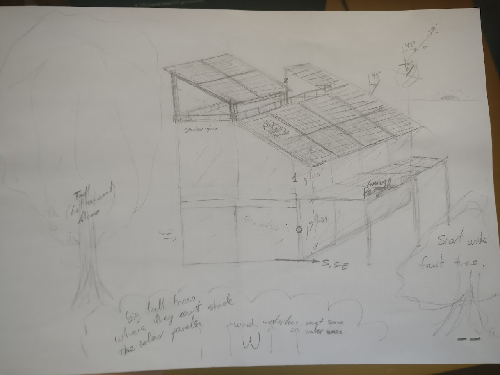

# Introduction
!!! details "Home drawings"

    
    
    

    **AI renders**
    
    

Find the most ideal places, and design a good independent house, from first principles.

**One of the most expensive things** that people buy in their whole life is their homes, so I think it would be a good idea to know very well and early what we’re generally looking for, in order to make the best possible buying decision. Even if we end up renting one, it’s still expensive, and affects our mood and productivity.

I’m looking for a home design that **makes me productive** with the least possible effort, and does not hinder with useless stuff. **I want simplicity, but not limitations**. Design to not have problems. Minimum maintenance.

**Minimalism. Reduce the amount of stuff.** Have only a few quality electronic products with USB-C charging ports. Even remove potentially useful things that I use so rarely that when I need them, I don’t know where they are or even remember that I have them. Consider how to remove keys.

I like to build and design things, so I will add a workshop.

I don't want to have to water the plants by design. I'll do it if I want, but the house has to be nice without me having to be physically there and remember that responsibility. The little watering must be automatic. Most plants should be in the ground, like in a forest, with natural mycelium networks connecting them together, not in pots.

The house must withstand the roots of the trees. How to do it? (Metallic, ceramic, rocks, or chemical barrier)

The ground with grass-like strong and low maintenance plants.

**Off-grid capable, with storage and many solar panels, lots of rainwater collection and filtering**

# Main restrictions

!!! info "Climate Assumption"
    I'm assuming a nothern hemisphere and a bit coldish climate, southwards from the top of a hill. Otherwise the orientations have to be adapted.

- Sunlight: Distribute heat evenly around the house and around the day
    - Block most of the noon light, allow most of sunrise light, and some of sunset light. Awnings and curtains (Rolling shields or blackout curtains)
    !!! tip "Sunlight Strategy"
        At sunrise (the coldest moment of the day), the light must be able to heat the house from the east, through the entrance. 
        
        At noon it must be minimized
        
        At sunset somewhat allowed for the best light of the day.
        
        The awnings block the light, the inner curtains diffuse it.
        
        The heat is better distributed with a few rooms long in north-sourth, so convection works, rather than long east-west, where the ones at south are cooked and at north frozen.
- Access: To the house, all floors, and the workshop and garage
- Solar panels: South roof is inclined optimally for solar panels. They shall not be blocked.
- Trees: I want as many trees around as possible, without breaking the other requirements.
    !!! info "Tree Benefits"
        privacy, noise, wind, air quality, aesthetics
        Extends further down a lot, for extra summer shade even beyond the window (curtain wall), also outside, and leaves a place protected from rain. At the north, the roof is useless so -> rooftop
- Noise: I want to be able to make noise whenever I want (workshop and piano for example), but I don't want noise. Therefore, the house won't share walls with other neighbors.

- All water, electricity, fiber optic lines, etc. accessible like garage trays for cables.
- **Noise isolation** around the house, between rooms, between workshop and rooms.
    !!! info "Noise Isolation Techniques"
        Look for GreenGlue for holes, Acoustic Panels, Mass loaded vinyl between 2 layers of drywall, Acoustic Coat/Paint, Acoustic sealant, acoustic drywall… Also use bookcases, carpet, or noise absorbing panels on the ceiling for noise absorption
- **Off-grid capable, with storage and many solar panels, lots of rainwater collection and filtering**.
    - Separate drinking water, grey water, and dirty water. Store cold and hot water. Ability to bring water with a pickup. Also some hump at the lower part of the property to keep rainwater and make it filter into the ground. Filter drinking water more exhaustively.

- The bathroom at the warmest place: south or south-east (warm in morning).
- The kitchen at the west of the entrance, with the storage area (huge shelving) at north.

# Experiments, consider
- Room at level 0, with the Kitchen? To be close to workshop?
- librería en planta 1?

!!! info "Phase Change Material"
    Maybe use [Phase Change Material (PCM)](https://phasechange.com/). Some paraffin waxes could stabilize 23ºC with prefab homes. Be careful to use it in a house with a constant desired temperature. If the house is manually ventilated with undesired air temperatures, or the user wants high temperature changes, it can increase the energy consumption (obviously). *For example: In the summer cool the tank at night with the exterior radiator, and at daytime let the heat pump use the water tank instead of the exterior hot air to cool the house. In the winter, heat the water at 3pm with the exterior radiator, and let the heat pump extract that heat at night (more efficiency and less problems with freezing…)*

!!! info "Water filled passive radiator"
    Very simple and stabilizes the temperature. Transfer heat through air convection.

[Desiccant air conditioner](https://youtu.be/R_g4nT4a28U)

## Consider

!!! note "General Considerations"
    - Use glass that blocks IR in some locations? Prevent IR from the warm house from coming out in winter, or sun IR in summer. Maybe west windows with it, or only the upper region of the window, like a virtual awning. Only heat in winter towards the floor.
        - Normal glass lets UVA through (gets to deep skin layers, can be harmful, cause of skin cancer), but blocks UVB (what creates tan, vitamin D, and skin burns). UVC is damaging but absorbed by the ozone layer. I want only UVB through.
    - Some place that allows community without the hindrance of doors, fences, having to let someone in... No stealable stuff and open. Promote the town vibes. Not the depressing usual ones. Maybe just a cool tree-shaded bench near the entrance.
    - Several underground floors that take advantage of all the thermal mass of the ground, specially if the temperature fluctuates a lot.
    - Consider the elevation difference and access points (workshop at north, vehicle entry taking elevation into account)
    - Overhang with a cut at ~3mm to prevent liquids from sticking to the overhang.

- paraffin wax phase-change material to stabilize nice temperature perfectly
- Consider geothermal source to connect the heat pumps, if the location has great temperature changes. It's more efficient and prevents freezing the exchanger.

